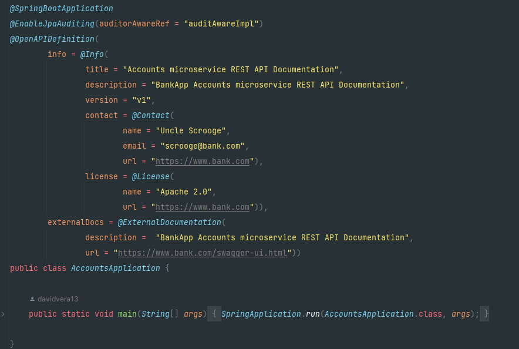
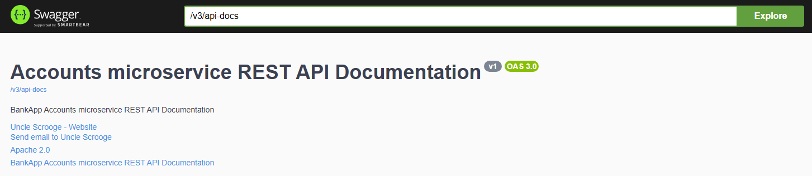
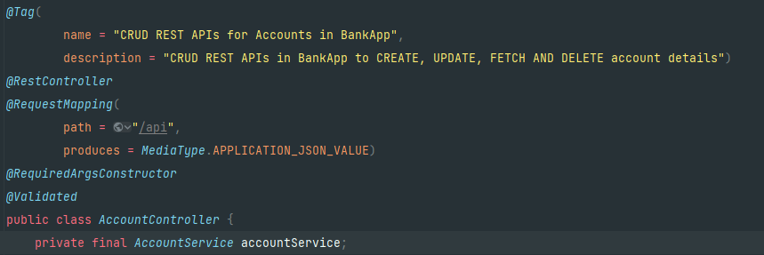
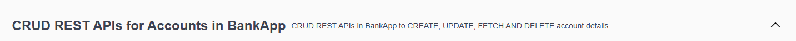
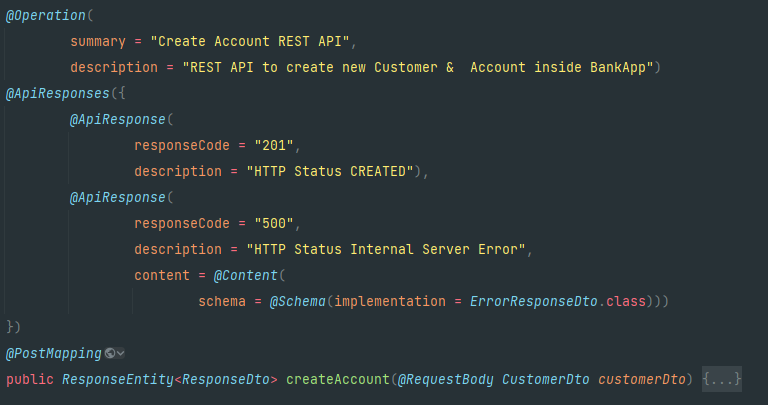
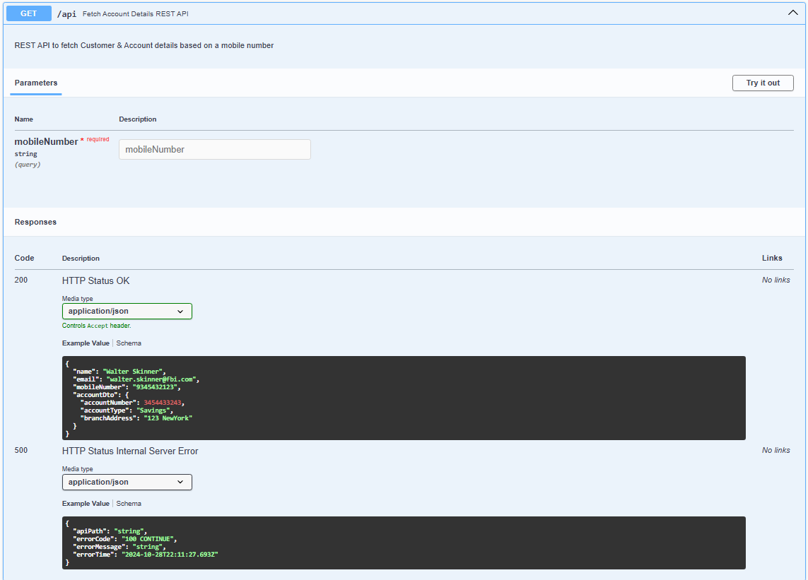
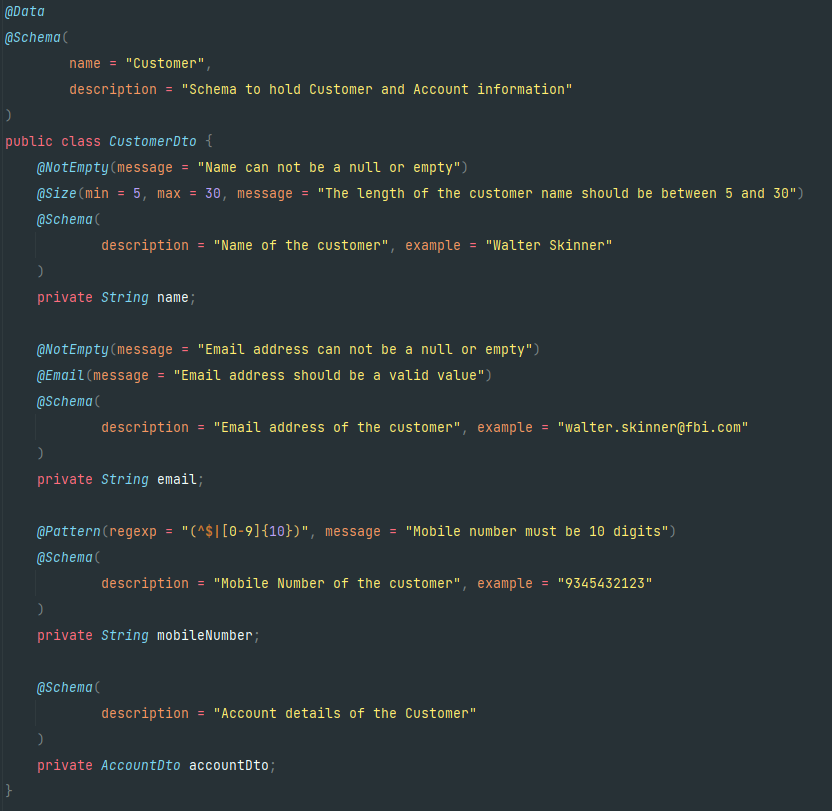
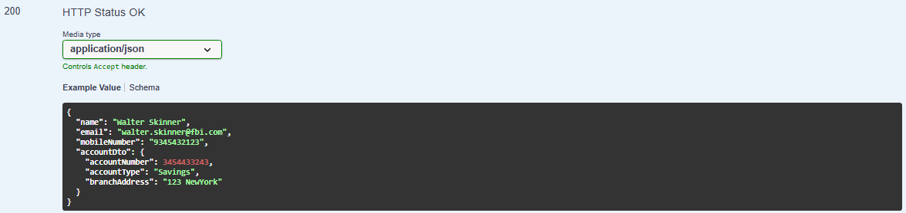
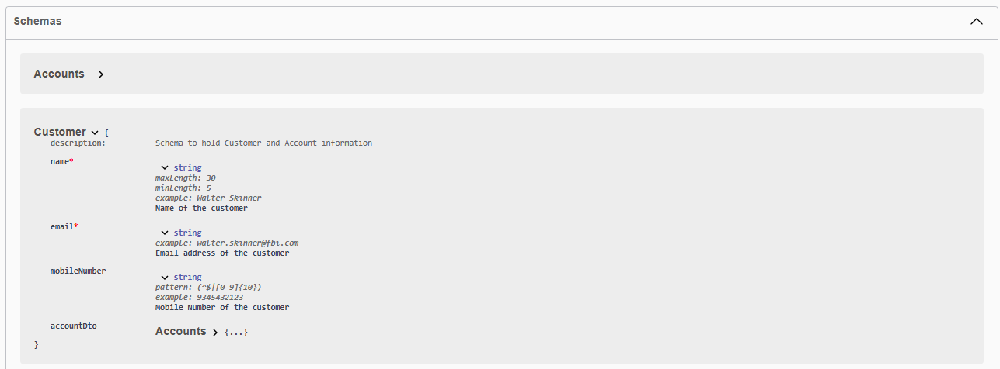

## Notes

### Configuring swagger:
#### Adding dependency: 

    <!-- https://mvnrepository.com/artifact/org.springdoc/springdoc-openapi-starter-webmvc-ui -->
    <dependency>
        <groupId>org.springdoc</groupId>
        <artifactId>springdoc-openapi-starter-webmvc-ui</artifactId>
        <version>2.6.0</version>
    </dependency>

### Adding annotations to class & methods
In the main class : 

Will generate the swagger header:

In the controller :

Will generate the swagger header:

In the controller methods: 

Will generate the method information & expected responses definitions:

In the DTO, we can pass information such as description and sample data:

We can have the sample in swagger

We also find same information in schemas part of swagger

