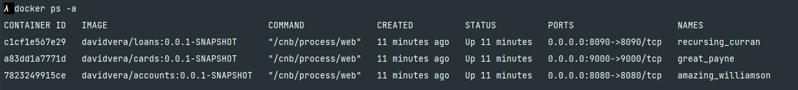

## Notes

### Using buildpacks
we can generate docker image using  single mvn command line

    mvn spring-boot:build-image

Note : we may have issue seeing containers running in docker desktop. 
We can list containers with 

    docker ps -a

