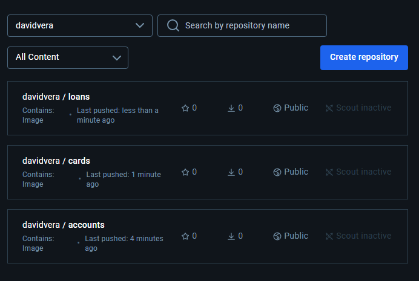
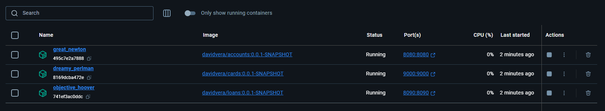

## Notes

### Create a cDockerfile
this file allow to build the docker image 
1. we use java 21 to build the jar in the builder step (FROM ... AS builder), we reference to another docker image
2. We define a working directory and copy maven, pom.xml and src content
3. We also need a light weight version of java to deploy the jar
4. we execute the maven command that build the spring boot jar
5. finally, in a second step, we define how applcation is launched using command lines

    FROM eclipse-temurin:21-jdk-alpine AS builder
    
    # Use adduser (lighter alternative to useradd)
    RUN adduser --home /home/appuser --disabled-password appuser
    USER appuser
    
    WORKDIR /opt/app
    # copy required files
    COPY ./.mvn/ ./.mvn
    COPY ./mvnw ./mvnw
    COPY ./pom.xml ./pom.xml
    
    RUN ./mvnw dependency:go-offline
    COPY ./src ./src
    RUN ./mvnw clean install -DskipTests
    
    
    FROM eclipse-temurin:21-jre-alpine
    
    # Use adduser (lighter alternative to useradd)
    RUN adduser --home /home/appuser --disabled-password appuser
    USER appuser
    
    WORKDIR /opt/app
    
    COPY --from=builder /opt/app/target/cards.jar /opt/app/cards.jar
    
    ENTRYPOINT ["java", "-jar", "/opt/app/cards.jar"]

### Create & launch a docker image
In the springboot application folder where is situated the Dockerfile file, launch the command: 

    docker build . -t davidvera/accounts:0.0.1-SNAPSHOT

Once completed, we can push the image to dockerhub: 

    docker image push docker.io/davidvera/accounts:0.0.1-SNAPSHOT

if we removed locally the docker image, we can retrieve it from dockerhub: 

    docker pull davidvera/accounts:0.0.1-SNAPSHOT

We can run this command directly, it should pull the image in the same process: 

    docker run -d -p 8080:8080 davidvera/accounts:0.0.1-SNAPSHOT

### Helper file
to make easier the docker image creation and execution, in the project root folder, we have runme.bat file which 
1. create docker image
2. push docker image
3. run docker image

Images are published

And can be executed: 

