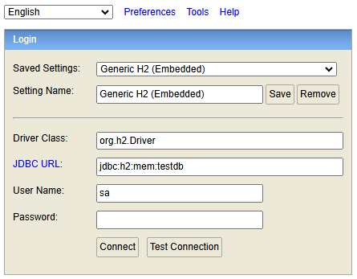
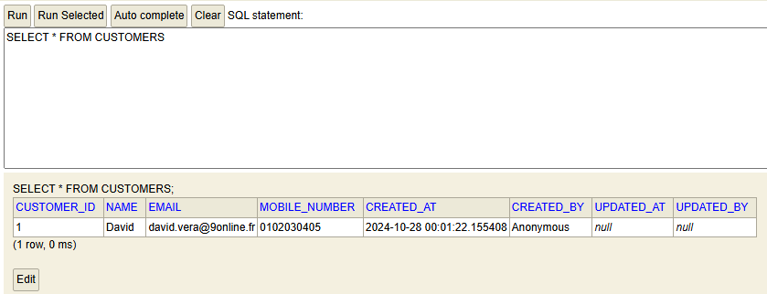
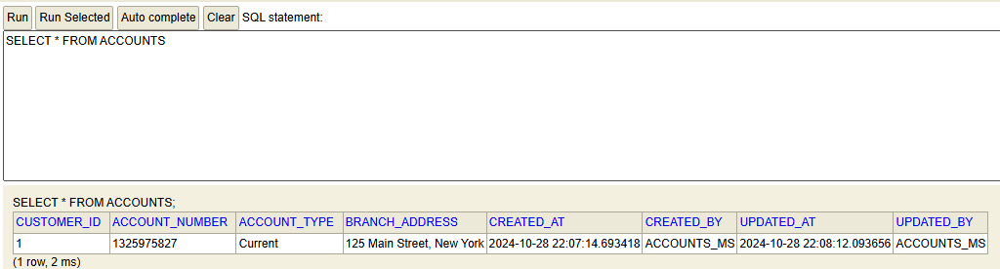

## Notes

### Challenge 1: creating webservices
#### Adding application.yaml configuration
When adding application.yaml properties:

    server:
        port: 8080
    spring:
        application:
            name: accounts
        # managing datasource ...
        datasource:
            url: jdbc:h2:mem:testdb
            username: sa
            password:
        h2:
            console:
            enabled: true
        jpa:
            database-platform: org.hibernate.dialect.H2Dialect
            hibernate:
                ddl-auto: update
        show-sql: true

We define db connection. here we can also access a database GUI using : 
  - http://localhost:8080/h2-console   

#### Adding entities & repositories
In the accountServiceImpl, for creating account, we added the following: 

    customer.setCreatedAt(LocalDateTime.now());
    customer.setCreatedBy("Anonymous");

And :

    newAccount.setCreatedAt(LocalDateTime.now());
    newAccount.setCreatedBy("Anonymous");

When creating account using postman, data is correctly inserted into database. 

CreatedAt, UpdatedAt, createdBy or updatedBy require tp pass the values to the webservice to be persisted.
In the entity class, we can add the following annotations : 

    @CreatedDate
    @CreatedBy
    @LastModifiedDate
    @LastModifiedBy
 
In the base entity we declare 

    @EntityListeners(AuditingEntityListener.class)

We should be able to set the createdAt value automatically and set automatically a value for createdBy:

@EnableJpaAuditing(auditorAwareRef = "auditAwareImpl") is added to Main class
@EntityListeners(AuditingEntityListener.class) annotation is added to BaseEntity

Finally, we add AuditAwareImpl class: 

    @Component("auditAwareImpl")
    public class AuditAwareImpl implements AuditorAware<String> {
        /**
         * Returns the current auditor of the application.
         *
         * @return the current auditor.
        */
        @Override
        public Optional<String> getCurrentAuditor() {
          return Optional.of("ACCOUNTS_MS");
        }
    }

If we create / update an account, fields with annotations are retrieving the expected values:

