## Using spring cloud config server

We need a new spring boot application with the 2 following dependencies: 

	<dependency>
        <groupId>org.springframework.cloud</groupId>
		<artifactId>spring-cloud-config-server</artifactId>
    </dependency>

	<dependency>
		<groupId>org.springframework.boot</groupId>
		<artifactId>spring-boot-starter-actuator</artifactId>
	</dependency>

We must add annotation :

    @SpringBootApplication
    @EnableConfigServer
    public class ConfigserverApplication {
    
        public static void main(String[] args) {
            SpringApplication.run(ConfigserverApplication.class, args);
        }
    }

In application.yaml: 
here is a basic spring cloud config server configuration

    server:
        port: 8071
    spring:
        application:
            name: configserver
        profiles:
            # we use native profile: we use class path to store properties
            active: native
        cloud:
            config:
                server:
                    native:
                        searchLocations: 'classpath:/configs'
                        # searchLocations: 'file:///D:/configs

Launch order is : 
> config server must be started first
> 
> other mucroservice ...

We can access to properties through gateway : 

http://localhost:8071/loans/prod
http://localhost:8071/loans/qa
http://localhost:8071/loans/default 
...

Here is a response example : 
Note we have a precedence properties for the profile > default profile > default application.yaml

    {
        "name": "loans",
        "profiles": [
            "prod"
        ],
        "label": null,
        "version": null,
        "state": null,
        "propertySources": [
            {
                "name": "classpath:/configs/loans-prod.yaml",
                "source": {
                    "build.version": "0.0.3-loans-PROD-REMOTE",
                    "loans.message": "Welcome to our localhost PROD loans management application",
                    "loans.contactDetails.name": "Fox Mulder - CEO",
                    "loans.contactDetails.email": "fox@bank.com",
                    "loans.callSupport": "-(33) 102030405 -(33) 102030406"
                }
            },
            {
                "name": "classpath:/configs/loans.yaml",
                "source": {
                    "build.version": "0.0.3-loans-REMOTE",
                    "loans.message": "Welcome to our REMOTE DEFAULT loans management application",
                    "loans.contactDetails.name": "John Steed - CTO",
                    "loans.contactDetails.email": "john@bank.com",
                    "loans.callSupport": "-(33) 102030405 -(33) 102030406"
                }
            },
            {
                "name": "classpath:/configs/application.yaml",
                "source": {
                    "contact.name": "David Vera DEFAULT REMOTE",
                    "contact.city": "Toulon REMOTE"
                }
            }
        ]
    }

### Configuring microservices to use config server: 

We first have to set spring.application.name if not exists 
we also have to add a profile to use

    spring:
        application:
            name: accounts
        profiles:
            active: 'prod'
          config:
            import: 'optional:configserver:http://localhost:8071'

We also must add dependency for using spring cloud config server

    <dependency>
        <groupId>org.springframework.cloud</groupId>
        <artifactId>spring-cloud-starter-config</artifactId>
    </dependency>

With the version passed in properties of the pom; 

    <properties>
        <java.version>21</java.version>
        <spring-cloud.version>2023.0.3</spring-cloud.version>
    </properties>

finally, we add the dependency management block :

    <dependencyManagement>
        <dependencies>
            <dependency>
                <groupId>org.springframework.cloud</groupId>
                <artifactId>spring-cloud-dependencies</artifactId>
                <version>${spring-cloud.version}</version>
                <type>pom</type>
                <scope>import</scope>
            </dependency>
        </dependencies>
    </dependencyManagement>

this configuration must be passed to all microservices 

The applications should use now the remote configurations. 

### Using github
Spring cloud config server can allow to use github as storage for configurations. 
Some changes are required to allow it, if the repo is public:
> profile is no longer native but git
> server is no longer native but git
> we pass uri, default label (branch), force pull, time out and if required a search path

    server:
        port: 8071
    spring:
        application:
            name: configserver
        profiles:
            # we use native profile: we use class path to store properties
            active: git
        cloud:
            config:
                fail-fast: true
            server:
                git:
                    uri: https://github.com/davidvera13/configuration-repo.git
                    default-label: master
                    clone-on-start: true
                    force-pull: true
                    timeout: 5
                    # if we have subfolders, we can pass the path here
                    search-paths: bank
                #native:
                    #searchLocations: 'classpath:/config'
                    ## searchLocations: 'file:./-- configs --/bank'

On startup: 

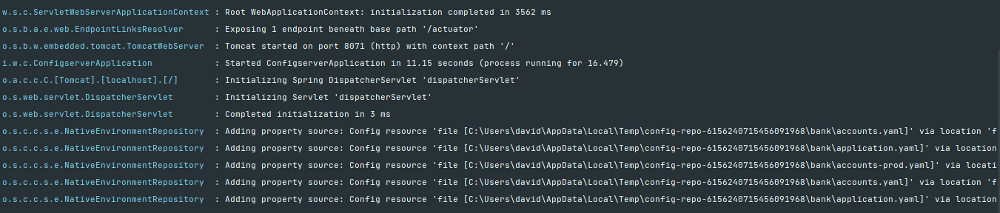

### Encrypt & Decrypt properties
We need first to add an encryption key in applications.yaml: 

    encrypt:
        key: 'Td8CJtD9yUC$XZK@_?Lw$]wv(M66(6'

encrypt / decrypt endpoint should be exposed.
We can encrypt any string using post to : http://localhost:8071/encrypt
We can also decrypt: http://localhost:8071/decrypt

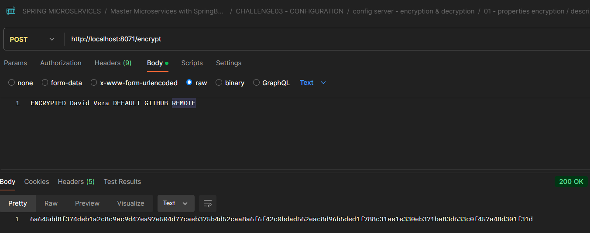

Value can be used in properties adding prefix {cipher}

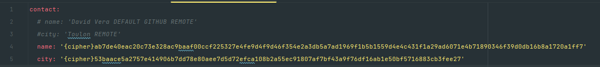

### Refreshing properties without restarting
#### Using refresh actuator path

We need to activate refresh actuator endpoint: 
We can pass endpoint to activate individually here we should pass 'refresh'. passing * indicates we activate them all

    management:
        endpoints:
            web:
                exposure:
                    include: *

When updating in github the properties, they can be accessed up to date with spring cloud config server: 

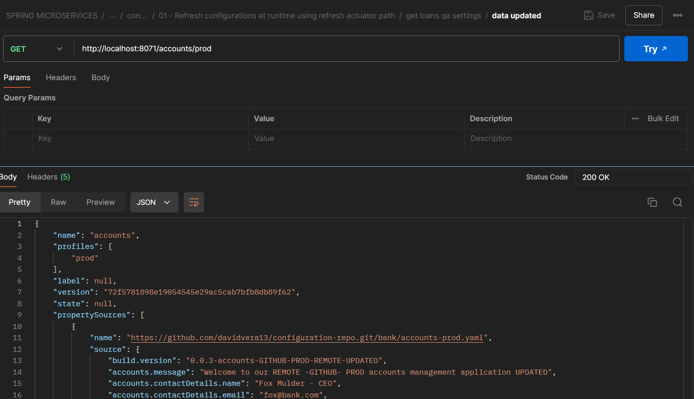

they're still not available for microservices.
We need to update and reflect updates we should restart microservices. We can use actuator refresh instead. 

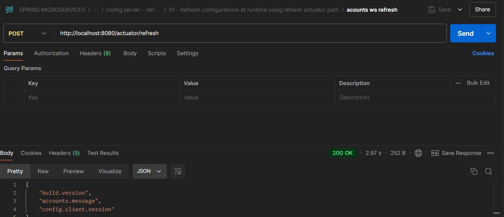

if we run this endpoint, we'll refresh the values for a single microservice. 

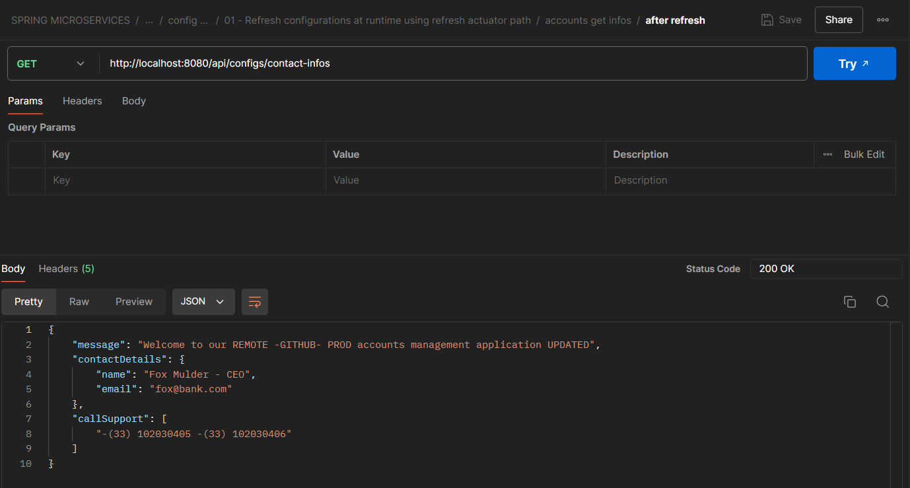

Nice ... but far from being enough. 

> How do we manage 100 microservices ? 
> 
> How do we manage load balanced applications ?
> 
> We must run the refresh call to all microservices and all instances ... 

#### Using Spring Cloud Bus
this approach requires to use Rabbit MQ.
We must add: 

    <dependency>
        <groupId>org.springframework.cloud</groupId>
        <artifactId>spring-cloud-starter-bus-amqp</artifactId>
    </dependency>

In application.yaml, we can use those propertie. Here values set are default values:

    spring;
        rabbitmq:
            password: guest
            username: guest
            host: localhost
            port: 5672

Once rabbitMQ is started, we can start spring cloud config server and microservices. 

> http://localhost:8080/actuator/busrefresh

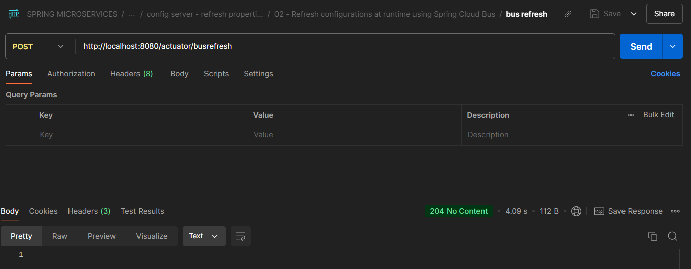

A single call to a webservice bus refresh endpoint refreshes all webservices.

#### Adding Spring Cloud Monitor to spring cloud bus
Should we call an enpoint to automatically refresh values ?

First, add the following dependency to all spring cloud config server:

    <dependency>
        <groupId>org.springframework.cloud</groupId>
        <artifactId>spring-cloud-config-monitor</artifactId>
    </dependency>

we will also need a webhook to in github. For this we will use a configured webhook.
Secondly, in github, select settings tab in the repo containing configurations. 
Thirdly, in the left side select webhooks item in menu

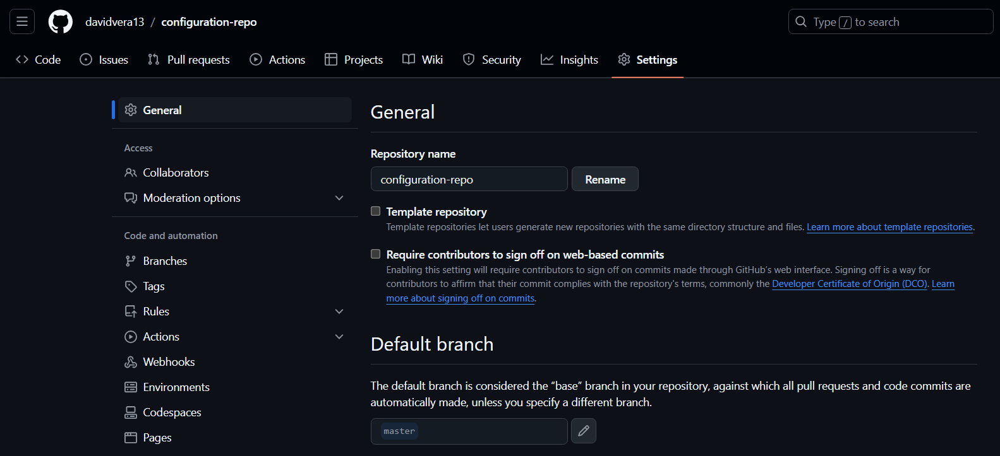

In the webhook page, click on add webhook

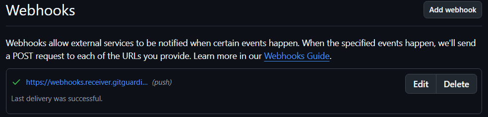

If we want to set the webhook, url should be : 

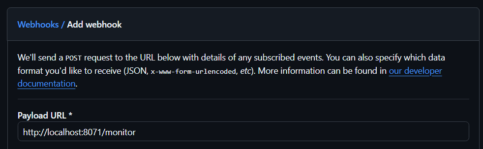

this url will not work actually because unavailable from github.
We're going to use hookdeck to override this issue. 

Let's go to: https://hookdeck.com/
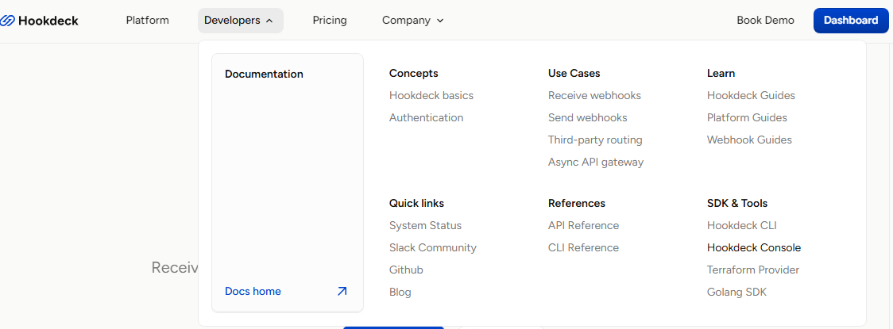

Click on developpers > Hookdeck Console
Once console is opened, click on add destination: 

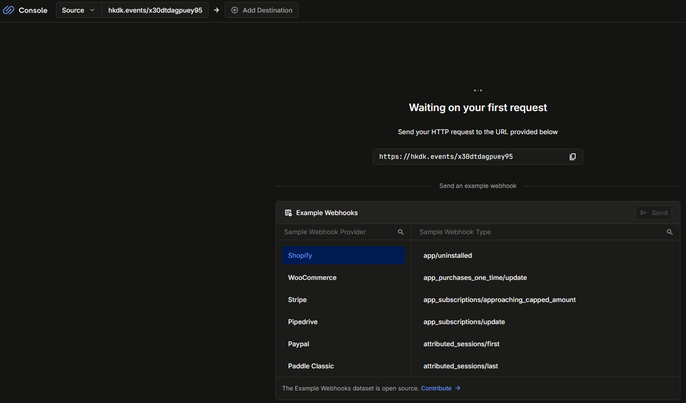

A list of command line allow to configure hookdeck webhook.
As i have node installed, i can use npm

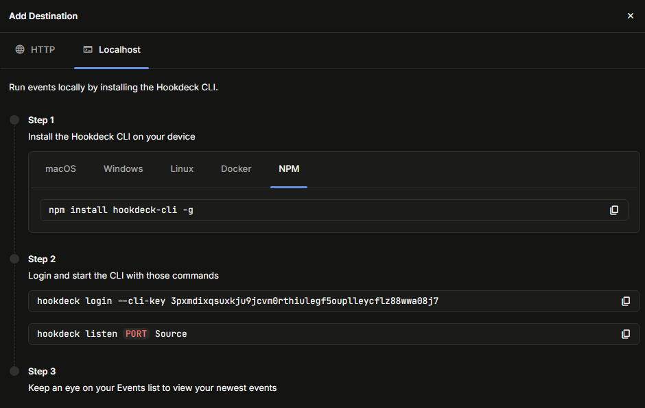

Here we make a bridge betweek the remote hookdeck webhook and config server

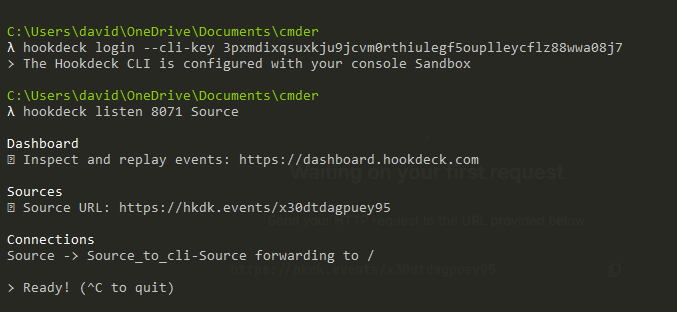

Note if forwarding to is / it should be modified. 

> first click ctrl + C tp stop listening

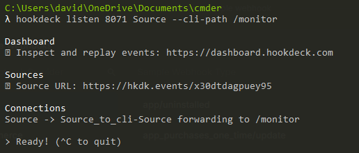

Command line should be :
> hookdeck login --cli-key 3pxmdixqsuxkju9jcvm0rthiulegf5ouplleycflz88wwa08j7
> 
> hookdeck listen 8071 Source --cli-path /monitor

Set content type to application / json 
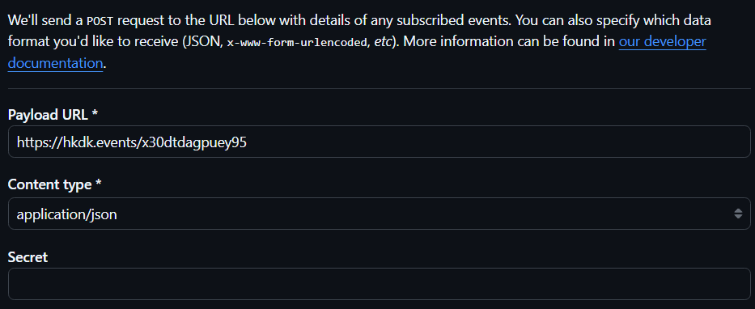

Finally click on add webhook...

Restart config server & microservices.
After pushing on github config updates, We note some logs in spring cloud config server. 
Data seemed to be refreshing: 

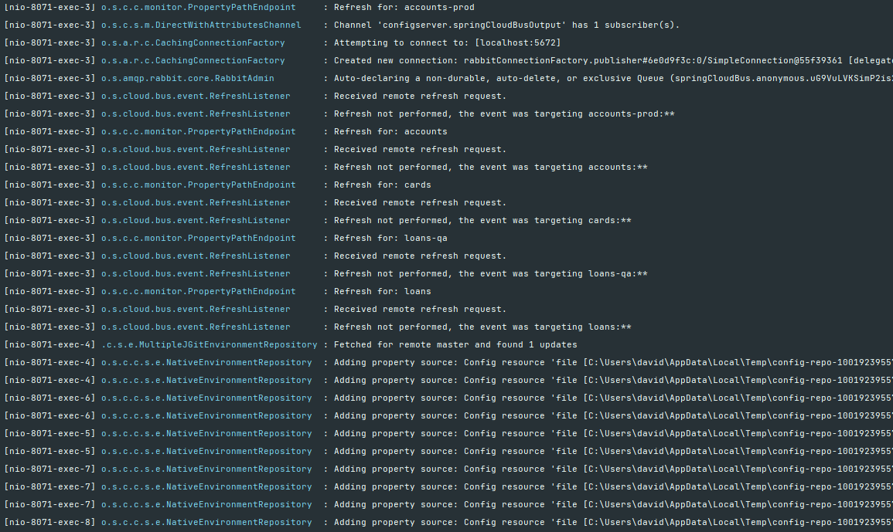

if we check in postman, all updated configurations are available in any microservice without any web call. 

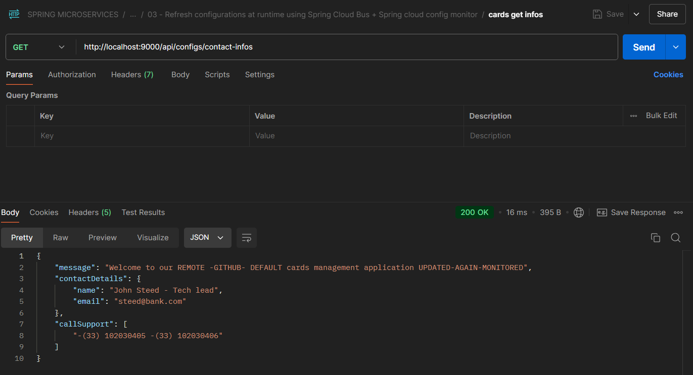

We can have a trace in Github & hookdeck 

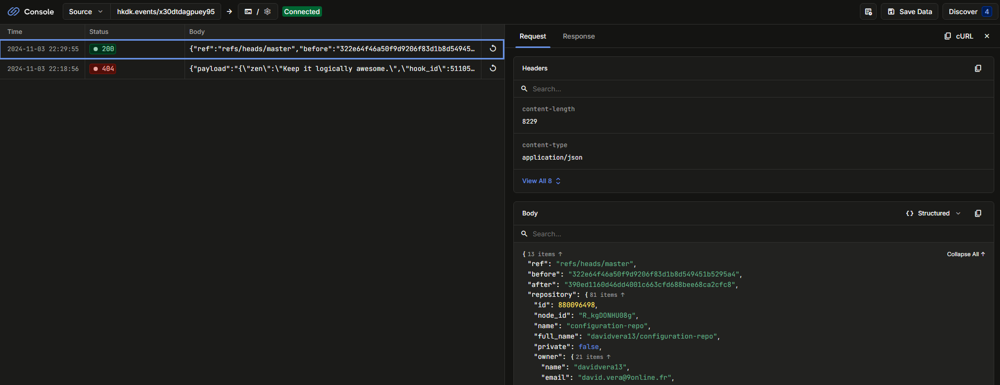

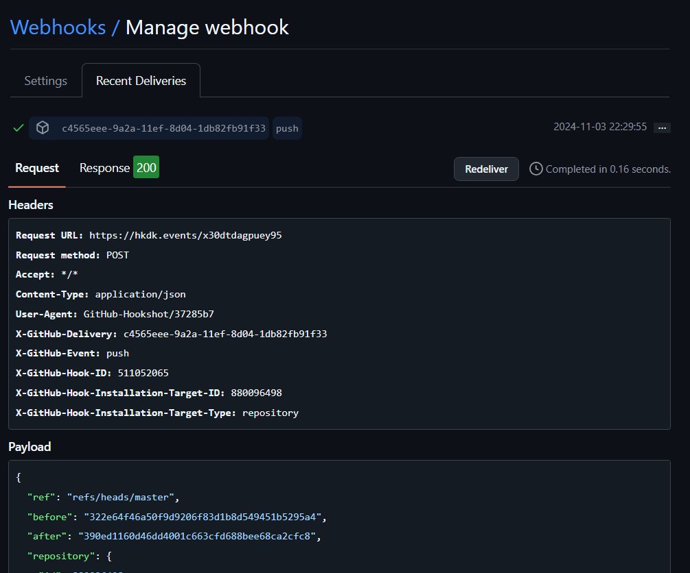

We can see commit details in the webhook message

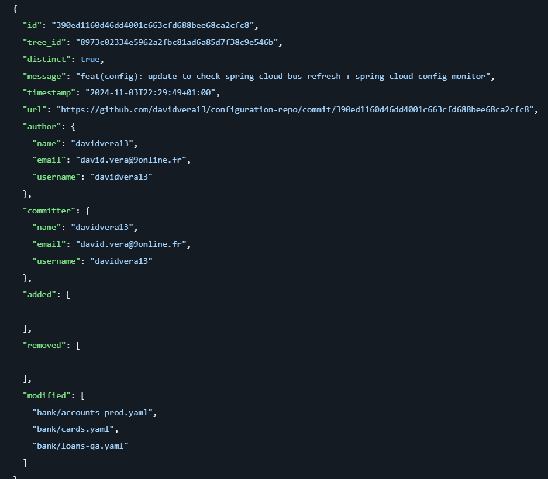

