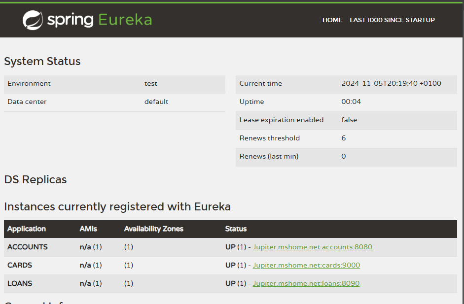
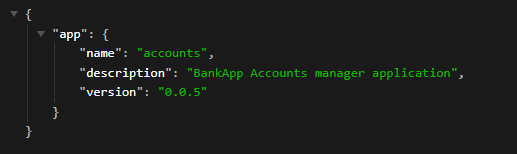
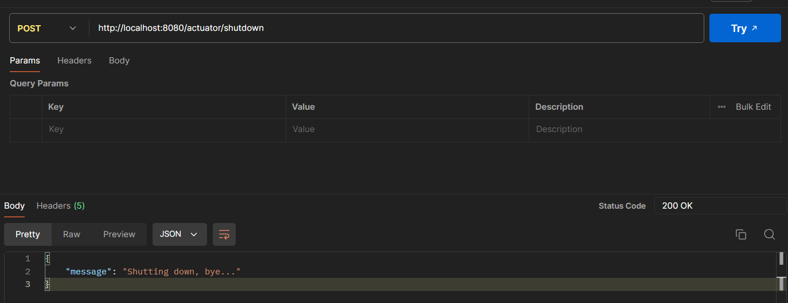
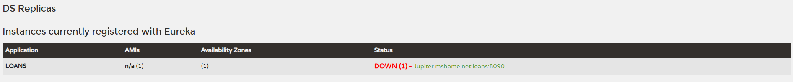

## Eureka discovery Server
### Setup and server configuration
To create an eureka discovery server we need a new Spring boot application with the following dependencies.  

    <dependency>
        <groupId>org.springframework.boot</groupId>
		<artifactId>spring-boot-starter-actuator</artifactId>
    </dependency>
	<dependency>
		<groupId>org.springframework.cloud</groupId>
		<artifactId>spring-cloud-starter-config</artifactId>
	</dependency>
	<dependency>
		<groupId>org.springframework.cloud</groupId>
		<artifactId>spring-cloud-starter-netflix-eureka-server</artifactId>
	</dependency>
    <dependency>
	    <groupId>org.springframework.cloud</groupId>
		<artifactId>spring-cloud-starter-bus-amqp</artifactId>
	</dependency>

Notes: 
> starter config is required to use spring cloud config server properties.
> starter amqp is required to refresh properties

Once created, we add annotation to the main class: 

    @EnableEurekaServer
    @SpringBootApplication
    public class EurekaserverApplication {
    
        public static void main(String[] args) {
            SpringApplication.run(EurekaserverApplication.class, args);
        }
    }

As configuration is application.yaml : 

    server:
        port: 8070
    eureka:
        instance:
            hostname: localhost
        client:
            fetchRegistry: false
            registerWithEureka: false
            serviceUrl:
                defaultZone: http://${eureka.instance.hostname}:${server.port}/eureka/

    spring:
        application:
            name: eurekaserver
        profiles:
            active: 'default'
        config:
            import: 'optional:configserver:http://localhost:8071'
        rabbitmq:
            password: guest
            username: guest
            host: localhost
            port: 5672
    # enabling all endpoints in actuator
    management:
        endpoints:
            web:
                exposure:
                    include: '*'
        # those properties are used for docker to check readiness
        health:
            readinessstate:
                enabled: true
            livenessstate:
                enabled: true
        endpoint:
            health:
                probes:
                    enabled: true

Notes: 
> eureka client fetch registry is set to false because we don't want eureka server to fetch details from microservices
> 
> eureka client won't registrer with itself, so value is set to false
> 
> eureka service url default zone gives the url where eureka server exposes its fonctionnality and allow clients to register... 

### Configure web services to register

Add the following dependency to all services (except config server): 

    <dependency>
        <groupId>org.springframework.cloud</groupId>
        <artifactId>spring-cloud-starter-netflix-eureka-client</artifactId>
    </dependency>

it brings dependencies to applications to register to eureka server

We also need to add the following configuration to application.yaml;  

    # eureka configuration as client applicaiton
    eureka:
        instance:
            prefer-ip-address: true
        client:
        fetchRegistry: true
        registerWithEureka: true
        serviceUrl:
            defaultZone: http://localhost:8070/eureka/

    # enabling all endpoints in actuator
    management:
    endpoints:
        web:
        exposure:
            include: '*'
        endpoint:
            shutdown:
                enabled: true
        info:
            env:
                enabled: true
    
    endpoints:
        shutdown:
            enabled: true

    info:
        app:
            name: ${spring.application.name}
            description: "BankApp Accounts manager application"
            version: '0.0.5'

Start application with the following order : 
> configServer
> 
> eurekaServer
> 
> webservices

Opening http://localhost:8070

When clicking on link, we display actuator info : 

### Shutdown application gracefully
Actuator allow to shutdown instance: 

